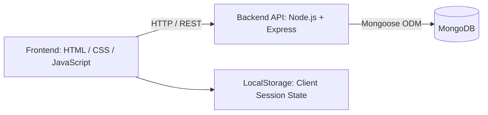
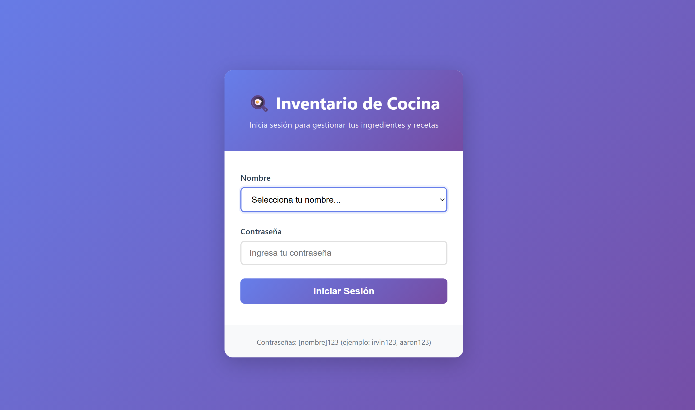
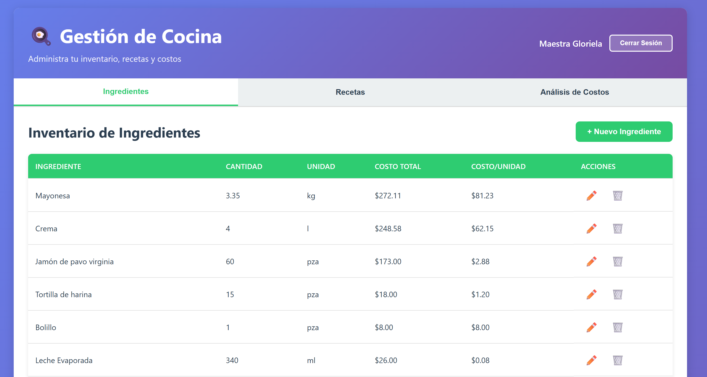
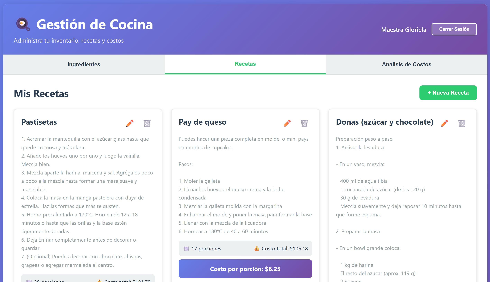
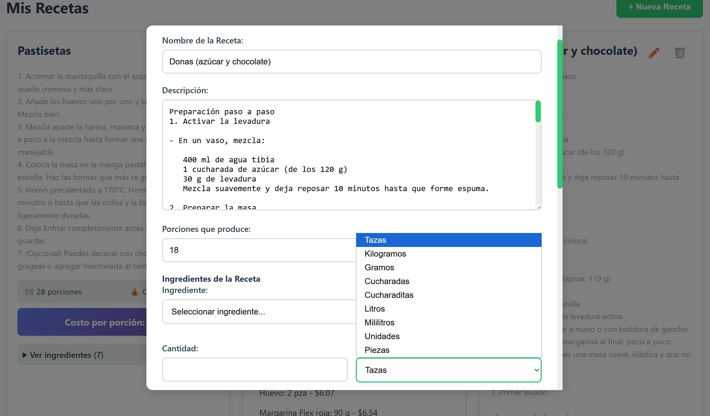
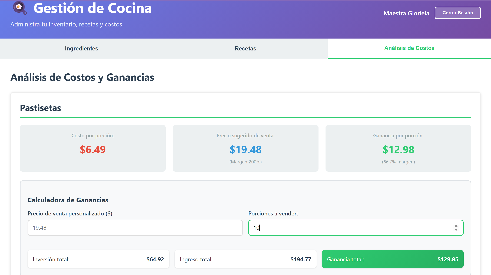

# 🍳 Kitchen Inventory & Recipe Costing System

> A full-stack web application designed to standardize recipe costing, centralize ingredient inventory, and support data-driven pricing and profitability decisions for kitchen and bakery operations.

## 🌐 Live Demo

- Production URL: https://panaderiacam15.vercel.app/

---

## 📖 About the Project

This system was developed to address a common challenge in food businesses: recipes may be prepared consistently, but selling prices are often defined without visibility into real production cost or margin per serving.

The application provides a centralized workflow for:

- Managing ingredients and inventory costs.
- Building recipes from existing ingredients.
- Applying unit conversions for consistent costing.
- Calculating total recipe cost and cost per serving.
- Analyzing selling prices and expected profitability.
- Supporting multiple users with logical data separation.

The project combines operational management with business logic, transforming ingredient and recipe data into actionable cost and pricing information.

---

## 🎯 Project Value

This project demonstrates the ability to:

- Model a real-world operational problem as software.
- Translate business requirements into explicit and testable rules.
- Implement cost calculation and unit conversion logic.
- Build a decoupled architecture using a static frontend, REST API, and MongoDB.
- Deploy a full-stack application using cloud infrastructure.

---

## ✨ Core Features

- 🔐 Basic user authentication with client-side session management.
- 👥 Multi-user data isolation through usuarioId filtering.
- 📦 Full CRUD operations for ingredients.
- 🍳 Full CRUD operations for recipes.
- ⚖️ Unit conversion during recipe creation.
- 💰 Automatic ingredient unit-cost calculation.
- 🧮 Automatic recipe cost calculation.
- 📊 Cost-per-serving and profitability analysis.
- 💵 Selling price and profit estimation.
- 🔎 Recipe-level cost breakdown.
- ❤️ API health-check endpoint for basic observability.
- 📱 Responsive user interface.

---

## 🧠 Business Logic

### 5.1 Inventory Costing

Each ingredient is registered using:

- Purchase quantity
- Total purchase cost
- Purchase unit

The unit cost is calculated as:

```text
unitCost = totalCost / purchaseQuantity
```

This provides a standardized cost basis for calculating the cost of ingredients used in recipes.

---

### 5.2 Unit Conversion

When an ingredient is added to a recipe, the requested quantity is converted to a compatible unit used by the inventory record.

Supported examples include:

- 1 cup = 240 g or 240 ml
- 1 tablespoon = 15 g or 15 ml
- 1 teaspoon = 5 g or 5 ml
- 1 kg = 1,000 g
- 1 L = 1,000 ml

If a valid conversion between selected units does not exist, the operation is prevented to avoid inaccurate costing.

> Conversion factors are defined according to measurement type and are intended to provide consistent operational estimates rather than universal physical equivalences.

---

### 5.3 Recipe Costing

For a recipe containing N ingredients:

```text
ingredientCost = Σ(quantityUsed_i × unitCost_i)

totalRecipeCost = ingredientCost + packagingCost

costPerServing = totalRecipeCost / servings
```

This allows the system to automatically determine production cost per recipe and cost per serving.

---

### 5.4 Pricing & Profitability

The system allows users to register a selling price and analyze expected profitability per recipe.

```text
profitPerServing = sellingPrice - costPerServing

profitMargin = (profitPerServing / sellingPrice) × 100
```

The resulting analysis connects operational data with business decisions, allowing users to evaluate whether a selling price provides a sustainable margin.

---

## 🏗 System Architecture

The application follows a three-layer architecture:



### Frontend

Responsible for:

- User interface and interaction.
- Form handling and data capture.
- Client-side rendering.
- Session state management.
- Communication with the REST API.

### Backend

Responsible for:

- REST API endpoints.
- Request validation.
- Business logic.
- Recipe and ingredient persistence.
- Cost calculation logic.
- CORS configuration.

### Database

MongoDB provides persistent storage for:

- Users
- Ingredients
- Recipes

---

## 🛠 Tech Stack

### Frontend

- HTML5
- CSS3
- Vanilla JavaScript

### Backend

- Node.js
- Express.js
- Mongoose
- dotenv
- cors
- body-parser

### Database

- MongoDB

### Deployment

- Static frontend: Vercel
- Backend API: Render

---

## 🔌 REST API

### Base URLs

Local:

```text
http://localhost:8080/api
```

Production:

```text
https://inventario-cocina-backend.onrender.com/api
```

### Authentication

| Method | Endpoint     | Description                         |
|--------|--------------|-------------------------------------|
| POST   | /auth/login  | Authenticate a user                 |
| POST   | /auth/seed   | Create initial users for setup      |

### Ingredients

| Method | Endpoint                     | Description            |
|--------|------------------------------|------------------------|
| GET    | /ingredientes?usuarioId={id} | Get user ingredients   |
| GET    | /ingredientes/:id            | Get one ingredient     |
| POST   | /ingredientes                | Create an ingredient   |
| PUT    | /ingredientes/:id            | Update an ingredient   |
| DELETE | /ingredientes/:id            | Delete an ingredient   |

### Recipes

| Method | Endpoint                | Description          |
|--------|-------------------------|----------------------|
| GET    | /recetas?usuarioId={id} | Get user recipes     |
| GET    | /recetas/:id            | Get one recipe       |
| POST   | /recetas                | Create a recipe      |
| PUT    | /recetas/:id            | Update a recipe      |
| DELETE | /recetas/:id            | Delete a recipe      |

### Health Check

```text
GET /health
```

Returns the current API status and database connection status.

---

## 📦 Example API Payloads

### Create an Ingredient

```json
{
  "usuarioId": "66f0...",
  "nombre": "Flour",
  "cantidad": 1000,
  "unidad": "g",
  "costoTotal": 35
}
```

### Create a Recipe

```json
{
  "usuarioId": "66f0...",
  "nombre": "Classic Brownie",
  "descripcion": "Batch of brownies",
  "porciones": 12,
  "ingredientes": [
    {
      "ingredienteId": "66f1...",
      "cantidadUsada": 250,
      "unidadReceta": "g"
    },
    {
      "ingredienteId": "66f2...",
      "cantidadUsada": 3,
      "unidadReceta": "unidad"
    }
  ],
  "costoEmpaquetado": 18,
  "precioVenta": 35
}
```

---

## 📸 Screenshots

Current product screenshots:

- Login
- Dashboard (Ingredients)
- Recipes Dashboard
- New Recipe Form
- Cost Analysis

### Login



### Dashboard Ingredients



### Recipes Dashboard



### New Recipe



### Cost Analysis



---

## 🚀 Installation

### Prerequisites

- Node.js 18+
- npm
- Local MongoDB instance or MongoDB Atlas

### Backend

```bash
cd backend
npm install
cp .env.example .env
npm run dev
```

### Frontend

From the project root:

```bash
python3 -m http.server 3000
```

Then open:

```text
Frontend: http://localhost:3000
Backend:  http://localhost:8080
Health:   http://localhost:8080/api/health
```

---

## ⚙️ Environment Variables

Create backend/.env:

```env
MONGODB_URI=mongodb://localhost:27017/inventario-cocina
PORT=8080
NODE_ENV=development
FRONTEND_URL=http://localhost:3000
```

### Configuration

- MONGODB_URI: MongoDB connection string. Can point to MongoDB Atlas in production.
- PORT: Backend API port.
- NODE_ENV: Application environment.
- FRONTEND_URL: Frontend origin used for CORS configuration.

---

## 🔮 Future Improvements

### Security

- Password hashing with bcrypt.
- JWT-based authentication.
- Improved session management.
- Role-based access control (RBAC).

### Inventory & Costing

- Automatic inventory deduction when producing recipes.
- Purchase batch history.
- Supplier management.
- Historical ingredient pricing.

### Analytics

- Configurable target profit margins.
- KPI dashboard.
- Average profit margin analysis.
- Most profitable recipes.
- Break-even analysis.

### Engineering

- Unit and integration tests for costing rules.
- Automated CI/CD validation.
- API documentation with OpenAPI/Swagger.
- Improved error handling and validation.

---

## 👩‍💻 Author

Gloriela Suarez Castaneda  
Full Stack Developer

GitHub: [GloDelMar](https://github.com/GloDelMar)

---

## 📄 License

Licensed under the MIT License. See [LICENSE](LICENSE).

---

## 🎯 What This Project Demonstrates

This project demonstrates the ability to:

- Translate operational requirements into explicit business rules.
- Design and implement a functional full-stack application.
- Build REST APIs with Node.js and Express.
- Work with MongoDB and Mongoose.
- Implement data-driven cost and pricing calculations.
- Connect a frontend application to a persistent backend.
- Deploy frontend and backend services independently.
- Build software focused on real operational and business needs.
